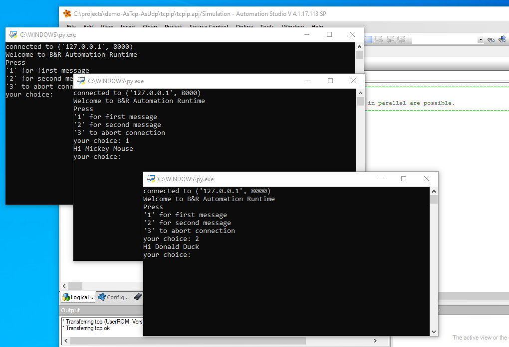
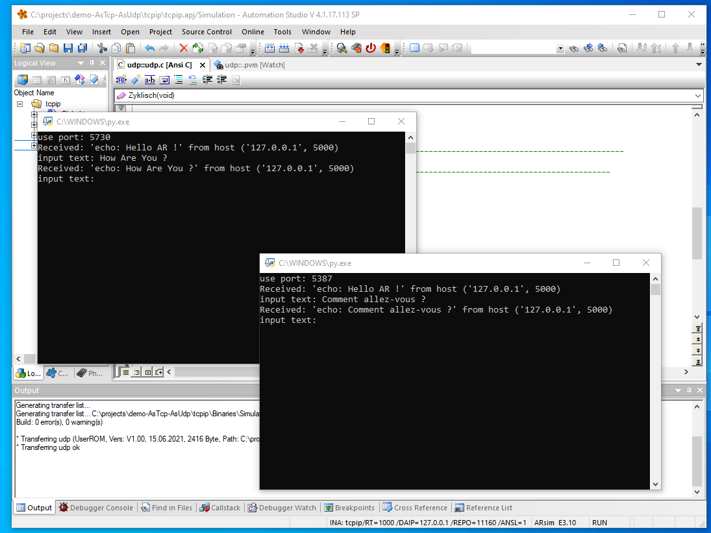

# demo-AsTcp-AsUdp
B&amp;R Automation Studio demo: how to use the TcpIp- system- libraries "AsTcp" and "AsUdp".
The tasks are each available in ST and in ANSI-C (I use two AS-configurations for that)

# TCP

Automation Runtime (ArSim) acts as an TCP server.
one or more instances of Pyhton script 'tcpclient.py' can be used to contact it.

# UDP

Automation Runtime (ArSim) listens on a port and echoes all incoming data back to sender.
Use Python script 'udpclient.py' to send messages to it.

![]

## Release
From my point of view, publishing releases for this project is without any real added value.
So just download the automation project from the repository.
The scripts are located in folder 'python'.

# Automation Studio
To try this example you need to have Automation Studio installed. 

Since I used the simulation ('ArSim'/'AR000'), you don't need a real PLC.

If you do not own a valid Automation Studio license then just download [version 4.1.4.x](https://www.br-automation.com/en/downloads/software/automation-studio/automation-studio-41/automation-studio-v41/).
It can be used free of charge since since 4.1.4.14.

  
