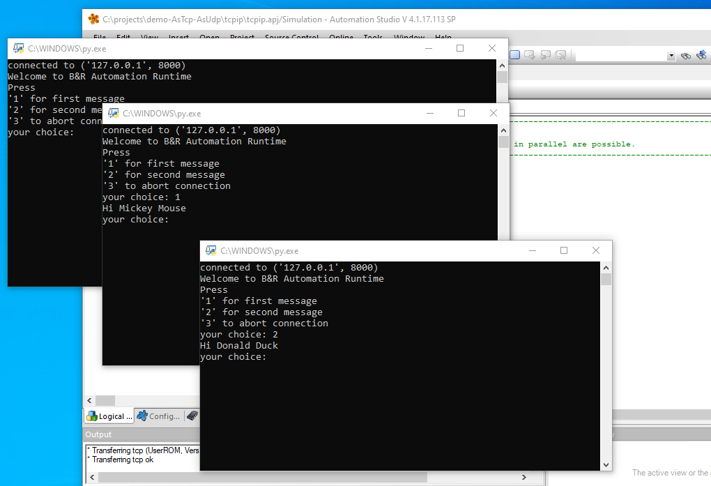
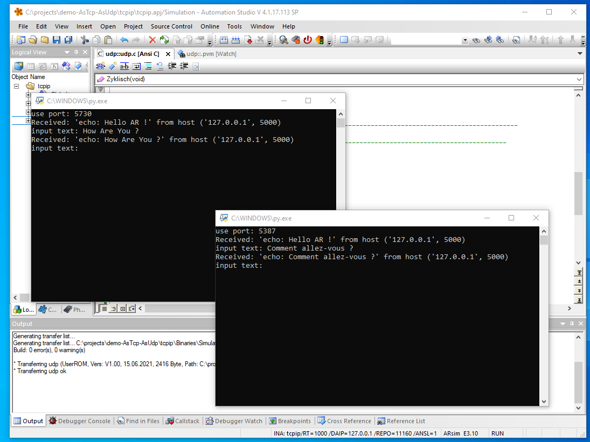

# demo-AsTcp-AsUdp
B&amp;R Automation Studio demo: how to use the TcpIp- system- libraries "AsTcp" and "AsUdp".
The tasks are each available in ST and in ANSI-C (project uses two AS-configurations for that)

# TCP Server

Automation Runtime (ArSim) acts as an TCP server.
one or more instances of Python script 'tools/tcpclient.py' can be used to contact the server.

# UDP Server

Automation Runtime (ArSim) listens on a port and echoes all incoming data back to sender.
Use Python script 'tools/udpclient.py' to send messages to it.

# Automation Studio
To try this example you need to have Automation Studio installed. 

Since simulation is configured ('ArSim'), you don't need a real PLC.

  
